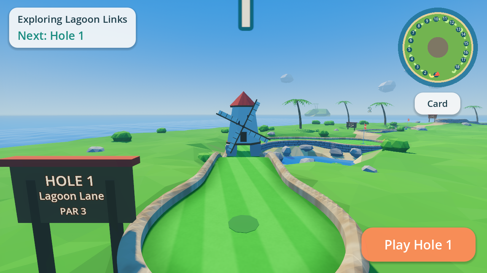
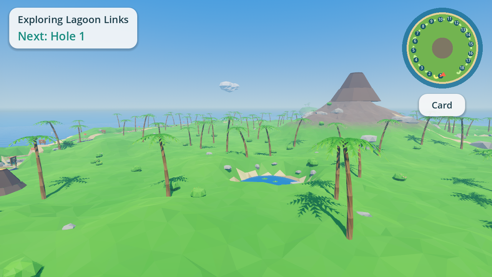
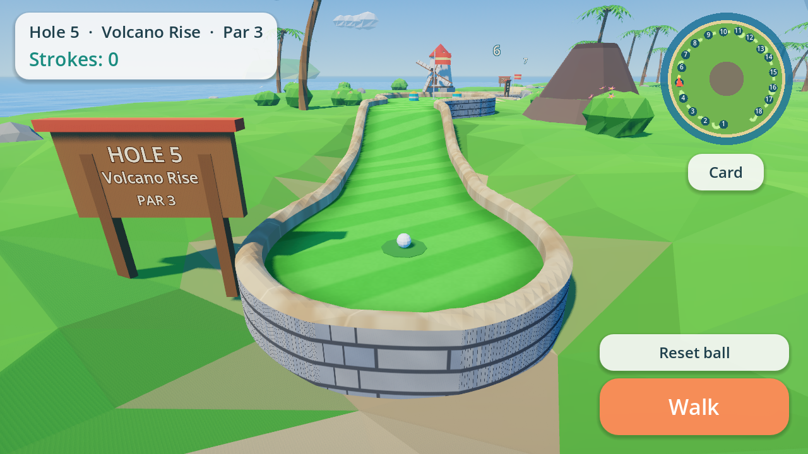
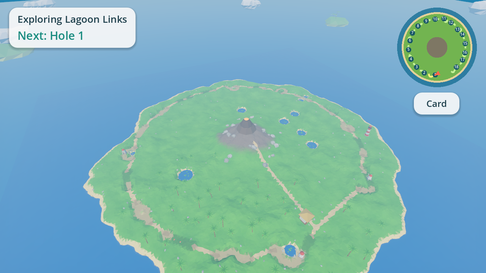

# Lagoon Links

A low-poly 3D mini golf game for Android phones, built with Godot 4.4. It's an original game,
not a port of any existing one.

You explore **one big island in first person**. All 18 holes (par 54) sit around it in playing
order, joined by sandy footpaths. There's a volcano in the middle, plus inland lakes, palm groves,
a clubhouse and a lighthouse. Walk up to any tee to play that hole. When you're ready to shoot,
switch to putt mode.



| Exploring | Putt mode |
| --- | --- |
|  |  |



## Build the APK in Android Studio

The ready-to-build Android project is in **`android/build`**.

1. Android Studio → **File → Open** → select the `android/build` folder.
2. Let Gradle sync. The first sync downloads the Godot engine library
   (`org.godotengine:godot:4.4.1.stable`, ~100 MB) from Maven Central, plus
   Android SDK 34 if you don't already have it.
3. Pick the **standardDebug** build variant (the default) and press **Run** with a
   phone plugged in (USB debugging on), or use
   **Build → Build App Bundle(s) / APK(s) → Build APK(s)**.
   The APK ends up at `android/build/build/outputs/apk/standard/debug/android_debug.apk`.

From a terminal you can also run `./gradlew assembleStandardDebug` inside `android/build`.

Notes:
- Builds cover `arm64-v8a` (phones) and `x86_64` (the emulator). Change
  `export_enabled_abis` in `android/build/gradle.properties` to add more.
- The package id is `com.lagoonlinks.minigolf` (also in `gradle.properties`).
- The game uses Godot's Mobile (Vulkan) renderer. On phones without Vulkan,
  Godot falls back to OpenGL ES 3.

## How to play (touch)

**Walk mode (first person)**

| Action | Touch |
| --- | --- |
| Walk | Left thumb anywhere on the left side: a joystick appears under it |
| Look around | Drag with your right thumb |
| Start a hole | Stand at a tee → **Play Hole N** |
| Go back to your ball | Walk up to it → **Putt** (or **Go to ball** from far away) |
| Fast travel | **Card** → tap a hole number |

A floating gold marker shows where to go: your ball while you're playing a hole, otherwise the
next hole you haven't played. The minimap (top right) shows every hole, you and your ball. Every
tee also has a big floating number.

**Putt mode**

| Action | Touch |
| --- | --- |
| Aim + putt | Touch the ball, pull back (the arrow and meter show power), let go |
| Orbit / zoom | Drag elsewhere / pinch |
| Back to exploring | **Walk** |
| Retry from the last spot | **Reset ball** |

Water costs a one-stroke penalty. Sink the ball and your score goes on the card. Tap the banner
to go back to exploring, facing the next tee. Play the holes in any order; after all 18 the card
offers a new round. On desktop, mouse drags act as touches and WASD also walks.

## The 18 holes

| # | Hole | Par | # | Hole | Par |
| --- | --- | --- | --- | --- | --- |
| 1 | Lagoon Lane | 3 | 10 | Sunset Strip | 2 |
| 2 | Palm Bend | 2 | 11 | Hook Harbor | 3 |
| 3 | Coral Steps | 3 | 12 | Log Hump | 3 |
| 4 | Twin Trails | 3 | 13 | Lighthouse Loop | 4 |
| 5 | Volcano Rise | 3 | 14 | Stepping Stones | 3 |
| 6 | Windmill Isle | 3 | 15 | Crab Canyon | 3 |
| 7 | Tiki Pinball | 2 | 16 | Spiral Shell | 4 |
| 8 | Snake Pass | 3 | 17 | Coconut Chute | 3 |
| 9 | Sunken Treasure | 3 | 18 | Grand Finale | 4 |


## Working on the game

The game source is a normal Godot 4.4 project at the repo root (open `project.godot`).
Everything is generated from code (no binary art assets), then **baked** into
`world/world.scn` so phones load the island in about a second instead of generating it.

| Path | What it does |
| --- | --- |
| `scripts/course/holes.gd` | All 18 hole layouts as data: path control points (x, height, z), widths, cup, obstacles, decor |
| `scripts/world/world_builder.gd` | Places the holes around the island, footpaths, landmarks; bakes `world/world.scn` |
| `scripts/world/island.gd` | Island terrain (walkable), mountain, lakes, hills, palms, bushes, grass |
| `scripts/course/lane_shape.gd`, `course_field.gd`, `course_builder.gd` | Turf, rails, walls and cup from a signed-distance field |
| `scripts/course/windmill.gd`, `spinner.gd`, `sliding_block.gd`, `obstacles.gd` | Moving obstacles and bumpers |
| `scripts/gameplay/walker.gd` | First-person walking (ground following, no walking into the sea) |
| `scripts/gameplay/golf_ball.gd`, `camera_rig.gd`, `aim_arrow.gd` | Ball physics (Jolt), putt camera, aim arrow |
| `scripts/ui/*` | HUD, joystick, minimap, scorecard |
| `scripts/main.gd` | Walk/putt modes, touch input, scoring, tests |

### After changing the game, refresh the Android project

```sh
GODOT=/path/to/Godot_v4.4.1 tools/sync_android_assets.sh
```

This re-bakes the island and re-exports the game data into `android/build/assets`.

### Tests and screenshots

```sh
godot --headless -- --bake                 # regenerate world/world.scn
godot --headless -- --autotest             # 75 checks: every hole, walking, touch, full play flow
godot -- --screenshot=out.png --fp=5       # first person behind hole 5's tee
godot -- --screenshot=out.png --putt=5     # putt mode on hole 5
godot -- --screenshot=out.png --aerial     # whole island
```
