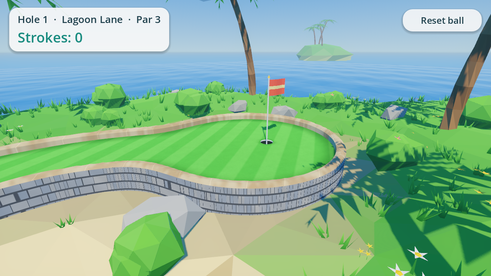

# Lagoon Links

A low-poly 3D mini golf game for Android phones, built with Godot 4.4.
It's an original game, not a port of any existing one. Hole 1 is
**Lagoon Lane** (par 3): a raised tee drops down a ramp, runs through a spinning
windmill, then doglegs right around a lily pond to a round green.


| Windmill | Green |
| --- | --- |
|  |  |

## Build the APK in Android Studio

The ready-to-build Android project is in **`android/build`**.

1. Android Studio → **File → Open** → select the `android/build` folder.
2. Let Gradle sync. The first sync downloads the Godot engine library
   (`org.godotengine:godot:4.4.1.stable`, ~100 MB) from Maven Central, plus
   Android SDK 34 if you don't already have it.
3. Pick the **standardDebug** build variant (the default) and press **Run** with a
   phone plugged in (USB debugging on), or use
   **Build → Build App Bundle(s) / APK(s) → Build APK(s)**.
   The APK ends up at `android/build/build/outputs/apk/standard/debug/android_debug.apk`.

From a terminal you can also run `./gradlew assembleStandardDebug` inside `android/build`.

Notes:
- Builds cover `arm64-v8a` (phones) and `x86_64` (the emulator). Change
  `export_enabled_abis` in `android/build/gradle.properties` to add more.
- The package id is `com.lagoonlinks.minigolf` (also in `gradle.properties`).
- The game uses Godot's Mobile (Vulkan) renderer. On phones without Vulkan,
  Godot falls back to OpenGL ES 3.

## Controls

| Action | Touch |
| --- | --- |
| Aim + putt | Put your finger on or near the ball, pull back, release |
| Orbit camera | Drag anywhere else |
| Zoom | Pinch |
| Reset ball | "Reset ball" button |

Water costs a one-stroke penalty and puts the ball back where it last stopped.
When you sink the ball you get a score banner; tap it to play again.

## Working on the game

The game source is a normal Godot 4.4 project at the repo root (open
`project.godot`). Everything is built procedurally from code, so there are no
binary art assets:

| Path | What it does |
| --- | --- |
| `scripts/course/hole_lagoon_lane.gd` | Hole layout: path control points (x, height, z), widths, cup, props |
| `scripts/course/lane_shape.gd`, `course_field.gd` | Lane shape as a signed-distance field on a grid |
| `scripts/course/course_builder.gd` | Marching-squares turf, chamfered rails, stone walls, cup, collisions |
| `scripts/course/windmill.gd` | Windmill obstacle with kinematic spinning sails |
| `scripts/world/*` | Island terrain, water, sky, clouds, palms, bushes, rocks, flowers |
| `scripts/gameplay/*` | Ball physics (Jolt), orbit camera, aim arrow |
| `scripts/ui/hud.gd` | HUD |
| `shaders/*` | Flat-shaded "facet" look, turf stripes, water with foam, swaying foliage |

To add a hole, copy `hole_lagoon_lane.gd` and change the control points. Ramps
are just control points at different heights.

### After changing the game, refresh the Android project

```sh
GODOT=/path/to/Godot_v4.4.1 tools/sync_android_assets.sh
```

This re-exports the game data into `android/build/assets`. You can also export
from the Godot editor: *Project → Export → Android* (it uses the Gradle build in
`android/build`).

### Tests and screenshots (headless)

```sh
godot --headless -- --autotest            # putt, drive, hole-out and water-hazard checks
godot -- --screenshot=out.png             # render the tee view to a PNG
godot -- --screenshot=out.png --view=-5.5,7.5,4.5,3.4,-0.5,-5.8   # custom camera (pos, target)
```
