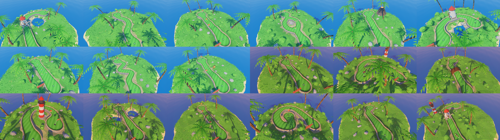
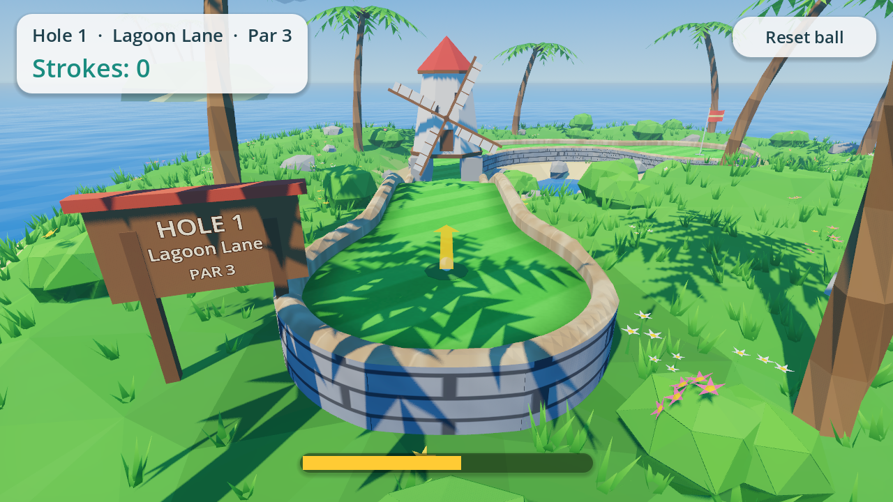
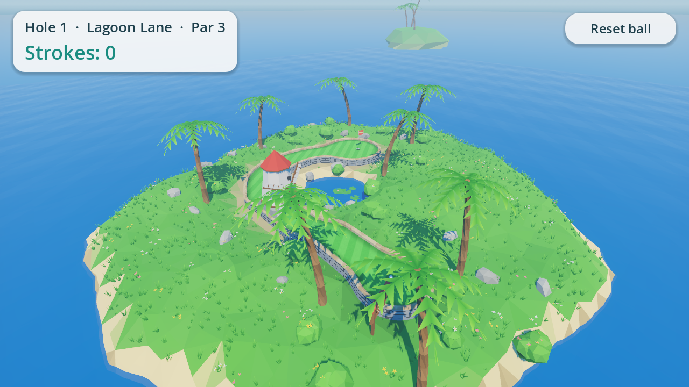
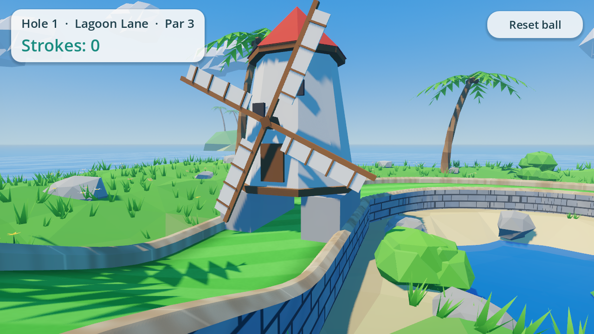
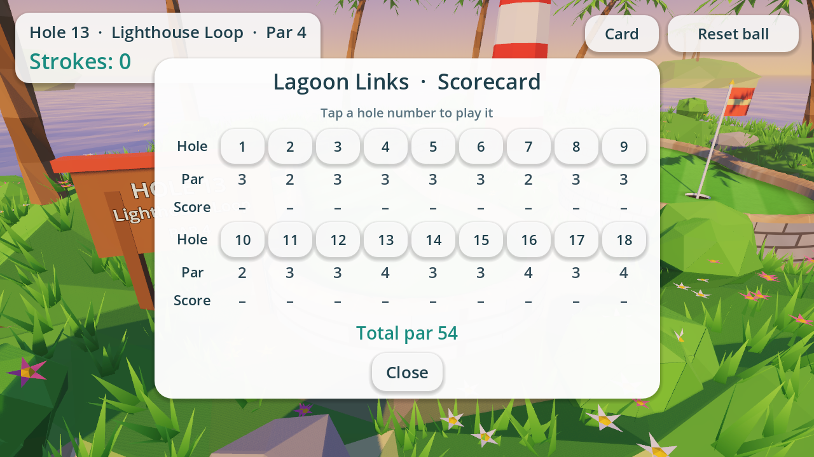

# Lagoon Links

A low-poly 3D mini golf game for Android phones, built with Godot 4.4.
It's an original game, not a port of any existing one: an **18-hole course (par 54)** of
tropical islands. There are ramps, windmills, spinners, sliding blocks, bumpers, forks,
a spiral and water hazards. The front nine is played in daytime and the back nine at golden hour.






| Windmill | Scorecard / hole picker |
| --- | --- |
|  |  |

| # | Hole | Par | # | Hole | Par |
| --- | --- | --- | --- | --- | --- |
| 1 | Lagoon Lane | 3 | 10 | Sunset Strip | 2 |
| 2 | Palm Bend | 2 | 11 | Hook Harbor | 3 |
| 3 | Coral Steps | 3 | 12 | Log Hump | 3 |
| 4 | Twin Trails | 3 | 13 | Lighthouse Loop | 4 |
| 5 | Volcano Rise | 3 | 14 | Stepping Stones | 3 |
| 6 | Windmill Isle | 3 | 15 | Crab Canyon | 3 |
| 7 | Tiki Pinball | 2 | 16 | Spiral Shell | 4 |
| 8 | Snake Pass | 3 | 17 | Coconut Chute | 3 |
| 9 | Sunken Treasure | 3 | 18 | Grand Finale | 4 |

## Build the APK in Android Studio

The ready-to-build Android project is in **`android/build`**.

1. Android Studio → **File → Open** → select the `android/build` folder.
2. Let Gradle sync. The first sync downloads the Godot engine library
   (`org.godotengine:godot:4.4.1.stable`, ~100 MB) from Maven Central, plus
   Android SDK 34 if you don't already have it.
3. Pick the **standardDebug** build variant (the default) and press **Run** with a
   phone plugged in (USB debugging on), or use
   **Build → Build App Bundle(s) / APK(s) → Build APK(s)**.
   The APK ends up at `android/build/build/outputs/apk/standard/debug/android_debug.apk`.

From a terminal you can also run `./gradlew assembleStandardDebug` inside `android/build`.

Notes:
- Builds cover `arm64-v8a` (phones) and `x86_64` (the emulator). Change
  `export_enabled_abis` in `android/build/gradle.properties` to add more.
- The package id is `com.lagoonlinks.minigolf` (also in `gradle.properties`).
- The game uses Godot's Mobile (Vulkan) renderer. On phones without Vulkan,
  Godot falls back to OpenGL ES 3.

## Touch controls

| Action | Touch |
| --- | --- |
| Aim + putt | Touch the ball, pull back (the arrow and meter show power), let go |
| Orbit camera | One-finger drag anywhere else |
| Zoom | Two-finger pinch |
| Reset ball | "Reset ball" button |
| Scorecard / jump to any hole | "Card" button, then tap a hole number |

Water costs a one-stroke penalty and puts the ball back where it last stopped.
When you sink the ball, tap the score banner to go to the next hole. After hole 18 you get
the full scorecard and can play again. The touch controls are covered by the automated
tests, which feed in simulated screen touches.

## Working on the game

The game source is a normal Godot 4.4 project at the repo root (open
`project.godot`). Everything is built procedurally from code, so there are no
binary art assets:

| Path | What it does |
| --- | --- |
| `scripts/course/holes.gd` | All 18 hole layouts as data: path control points (x, height, z), widths, cup, obstacles, decor |
| `scripts/course/lane_shape.gd`, `course_field.gd` | Lane shape as a signed-distance field on a grid |
| `scripts/course/course_builder.gd` | Marching-squares turf, chamfered rails, stone walls, cup, collisions |
| `scripts/course/windmill.gd`, `spinner.gd`, `sliding_block.gd`, `obstacles.gd` | Moving obstacles and bumpers |
| `scripts/world/*` | Island terrain, water, sky, clouds, palms, bushes, rocks, flowers |
| `scripts/gameplay/*` | Ball physics (Jolt), orbit camera, aim arrow |
| `scripts/ui/hud.gd` | HUD |
| `shaders/*` | Flat-shaded "facet" look, turf stripes, water with foam, swaying foliage |

To change or add a hole, edit `holes.gd`. Ramps are just control points at
different heights, and a fork is simply a second path.

### After changing the game, refresh the Android project

```sh
GODOT=/path/to/Godot_v4.4.1 tools/sync_android_assets.sh
```

This re-exports the game data into `android/build/assets`. You can also export
from the Godot editor: *Project → Export → Android* (it uses the Gradle build in
`android/build`).

### Tests and screenshots (headless)

```sh
godot --headless -- --autotest            # all 18 holes + touch controls + putt/drive/hole-out/water checks
godot -- --hole=5 --screenshot=out.png    # render a hole's tee view to a PNG
godot -- --contact=sheet.png              # render all 18 holes into one image
godot -- --screenshot=out.png --view=-5.5,7.5,4.5,3.4,-0.5,-5.8   # custom camera (pos, target)
```
