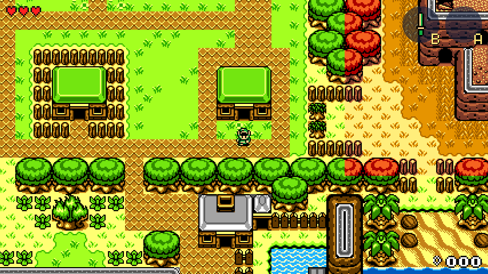
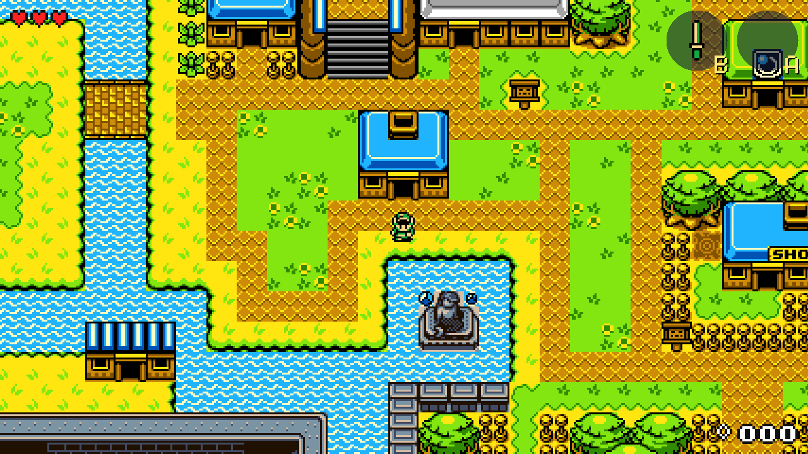
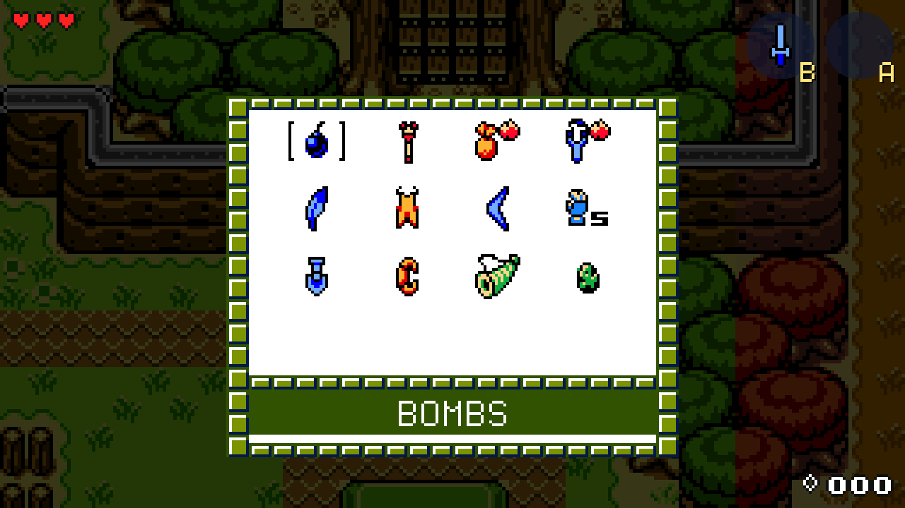
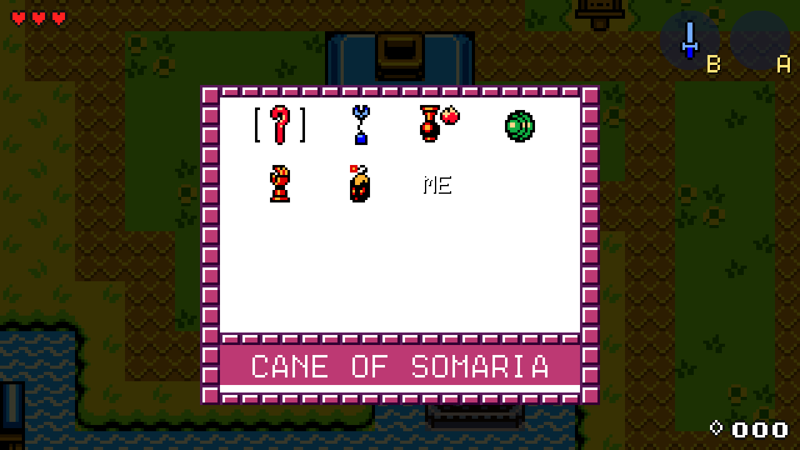
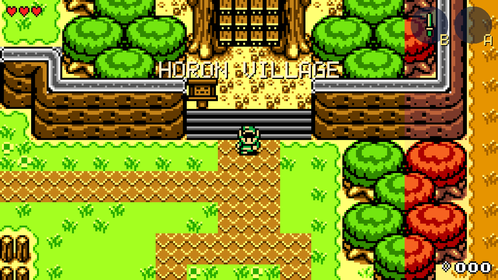
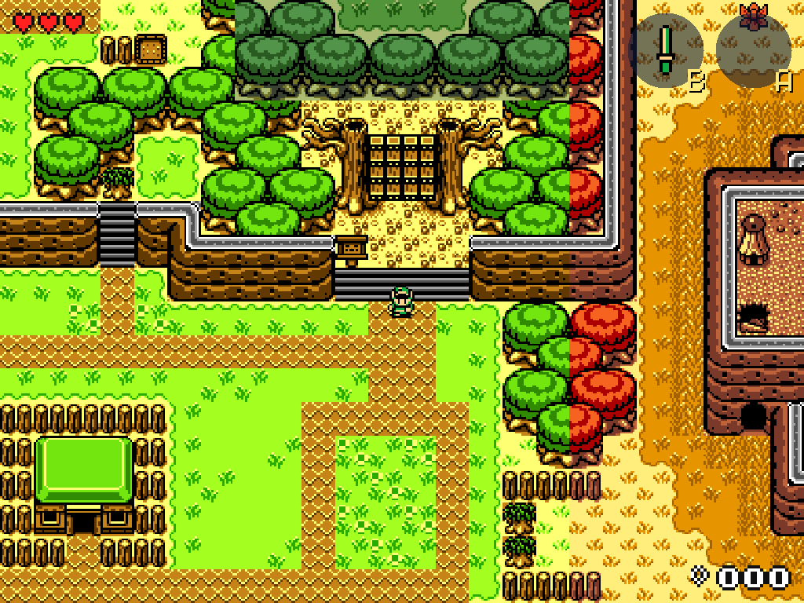
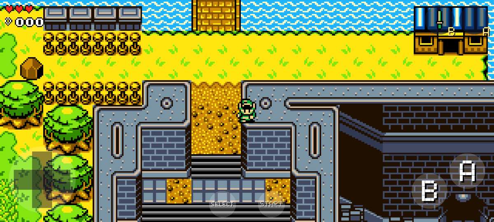

# Oracles One

*Oracle of Seasons* and *Oracle of Ages* as **one game**: a new native engine (C + SDL3) for PC and
Android. It reads the worlds, graphics and rules from the
[oracles-disasm](https://github.com/Stewmath/oracles-disasm) disassembly. Nothing runs Game Boy code
or emulates the hardware.

- **One seamless world.** The rooms are laid edge to edge, so walking off a screen just keeps
  going. No screen-by-screen scrolling, and the camera eases after Link.
- **Any screen shape.** Fill the screen, 16:9 or 4:3 (F2). Pinch, the mouse wheel, +/- or the
  shoulder buttons zoom from close-up out to a large part of the map.
- **Holodrum in its seasons.** Every area shows its own default season, as in Seasons. The Rod of
  Seasons changes the screen you stand on.
- **A new house in each main town** connects Holodrum and present-day Labrynna. Its front door in
  Horon Village opens into Lynna City and back. Each house copies a small house already in that
  town, so it looks and blocks like the originals.
- **One Link.** Hearts, rupees, items, rings, seeds and bombs are shared. Once you have all 16
  hearts, heart containers give 300 rupees and pieces of heart give 150.
- **Every item works in both worlds.** Item code never asks which world it's in, so Roc's Cape
  works in Labrynna and the Magnetic Gloves work in Holodrum.
- **Both games' item pages in one Start menu**, drawn from the originals' own inventory screens,
  cursor and font. The page of the world you're in comes first: Seasons' page in Holodrum,
  Ages' page in Labrynna. Select slides to the other one, and A or B equips the highlighted
  item.
- **Always a linked game**, starting from the first save.
- **Floating HUD** like *The Minish Cap*: hearts at top left, B and A at top right, rupees at
  bottom right. There's no status bar.
- **Place names.** Walking into a new area fades its name in and out, using the names the
  originals' map screen gives each screen ("Horon Village", "Maku Tree"...).

| Horon Village's new house (to Labrynna) | Lynna City's new house (to Holodrum) |
| --- | --- |
|  |  |
| **Start in Holodrum: Seasons' page first** | **Start in Labrynna: Ages' page first** |
|  |  |
| **Arriving in Horon Village** | **4:3, zoomed out** |
|  |  |



## Status

This is an early build. The overworlds, movement, collision, doors, shared state, HUD and
inventory work. Most of the game itself isn't in yet:

| Done | Not yet |
| --- | --- |
| Holodrum and present Labrynna overworlds from the disassembly, each Holodrum area in its season | Houses, caves, dungeons, Subrosia, Labrynna's past |
| Link walking, the originals' tile collision, sliding around corners | Ledges, holes, water, stairs, bushes and rocks |
| The two town houses' doors, in both directions | Sprites for NPCs, enemies and Seasons' Maku Tree |
| Shared hearts, rupees and items; extra hearts become rupees (tested) | Enemies, NPCs, scripts, text, chests, shops |
| Both games' original item pages, A/B equip, floating HUD | The other subscreens (rings, essences, map), linked secrets that NPCs recognise when you walk up to them, final boss |
| Roc's Feather and Cape jumps, Rod of Seasons, Magnetic Gloves polarity | Swinging the sword with its real animation; the other items' effects |
| Keyboard, gamepad, touch and pinch zoom, any aspect ratio | Sound and music |

`--all-items` gives every item of both games, for testing.

## Build

The game data is generated from the disassembly (a git submodule) and is not committed.

```bash
git submodule update --init oracles-one/disasm
cd oracles-one
pip install pillow
tools/build_assets.sh                 # writes assets/
cmake -S . -B build -G Ninja -DCMAKE_BUILD_TYPE=Release   # fetches SDL3 if it isn't installed
cmake --build build
ctest --test-dir build
./build/oracles-one
```

Controls: arrows or WASD move, X is A, Z is B, Enter is Start, Tab or Right Shift is Select,
+/- or the mouse wheel zoom, F2 changes the aspect ratio. Gamepads use their usual layout, with
the shoulder buttons zooming.

### Android

Run `tools/build_assets.sh` first. The APK packages `assets/`.

1. Android Studio → **File → Open** → `oracles-one/android`.
2. Let Gradle sync. It needs NDK 27.2.12479018 and CMake, and installs them if they're missing.
   The first build also downloads SDL3's source.
3. Run on a phone, or **Build → Build APK(s)**. It's arm64 only (any recent phone, such as a
   Snapdragon 8 Gen 2).

The game runs in landscape. Touch controls show the d-pad on the left, A/B on the right, and
Select/Start at the bottom. Pinch with two fingers anywhere else to zoom.

### Headless screenshots

```bash
SDL_VIDEO_DRIVER=offscreen SDL_RENDER_DRIVER=software ./build/oracles-one \
  --shot out.bmp --frames 120 --size 1280x720 --world labrynna --pos 1176,790 --hold U
```

This holds Up for 120 frames from just south of Lynna City's new house, so it goes through the
door into Holodrum. Other options: `--aspect 4:3|16:9`, `--zoom Z`, `--menu 0|1` (open the menu on
its first or second page), `--touch`, `--all-items`.

## Layout

- `tools/extract_world.py`: room layouts, tilesets, graphics and palettes from the disassembly
  become `metatiles.rgba` (every distinct 16x16 tile) and one `.map` per world (atlas index and
  the game's collision byte per tile). It writes Holodrum in its default seasons, plus each
  season in full for the rod, and `.names` with each screen's area name.
- `tools/extract_sprites.py`: Link, the HUD art, both games' item icons, their original item
  pages, the inventory cursor and the font, in the games' palettes.
- `src/world.c`: maps, drawing, and the originals' collision rules (`checkGivenCollision_allowHoles`).
- `src/link.c`: walking and collision. `src/items.c`: using items. `src/game.c`: the shared save
  and its rules.
- `src/hud.c`: the HUD and the Start menu with both games' item pages. `src/input.c`: keyboard, gamepad, touch, pinch.
- `src/main.c`: the loop, camera, zoom, aspect ratios, the town houses and screenshot mode.

Not affiliated with Nintendo or Capcom. The data comes from the community disassembly.
